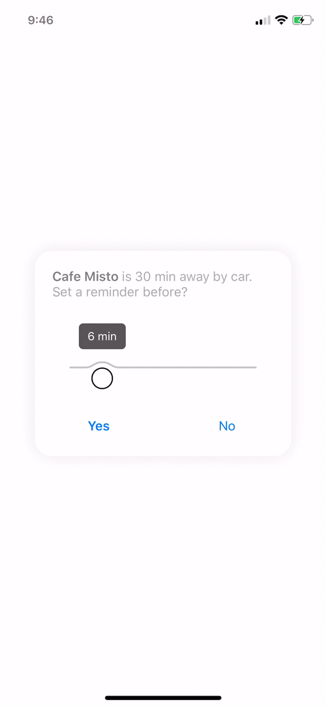

# Overview

`BCSlider` is a `UISlider` alternative inspired by [this](https://dribbble.com/shots/3461827-Text-recognition-to-do-app) dribbble. 

.

# How to setup

This repository is a demo project. To use `BCSlider` in your own project, simply download `BCSlider.swift` and add the required pods to your podfile. 

# How to use

You can directly customize the label, thumb, and curve. To set the slider's value, set `value` to a number in the range `0` to `1`, inclusive.

You can also add a closure to listen for changes in the slider's value by calling `onValueChanged`.
